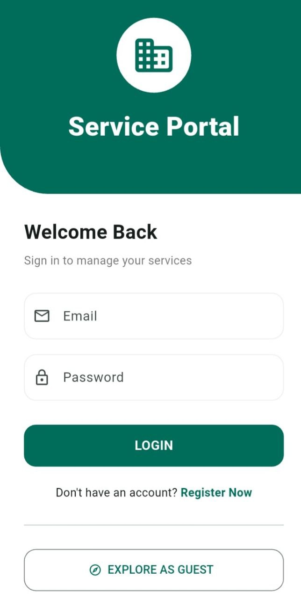
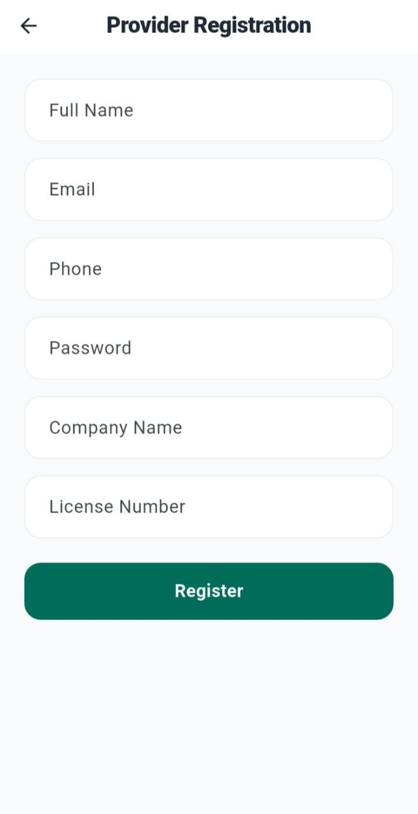
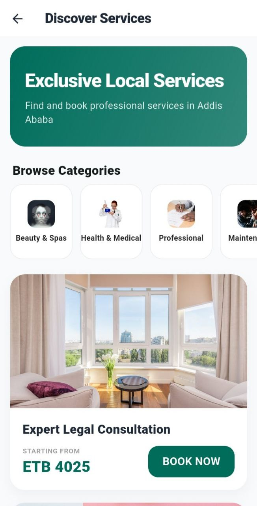

# 🇪🇹 Ethiopian Service Request App

A professional, high-end Flutter application designed for service discovery and management in Ethiopia. This app features a premium UI, real-time Firebase integration, and a seamless category-based service navigation system.

## 📸 App Preview

| Login Screen | Sign Up Screen | Explore Services |
|:---:|:---:|:---:|
|  |  |  |

## 📖 How the App Works

The application is split into two main flows to serve both customers and service providers:

### 1. Public Discovery (For Customers)
- **Guest Access**: Users can tap "Explore as Guest" from the login screen without creating an account.
- **Browse Categories**: Users can filter services by categories like "Beauty", "Medical", or "Professional".
- **Real-Time Listings**: View up-to-date service prices (ETB), descriptions, and high-quality representative images.
- **Booking**: Customers select a service and fill out a quick request form to book.

### 2. Provider Management (For Business Owners)
- **Secure Authentication**: Providers can register and login securely using Firebase Auth.
- **Service Control**: Once logged in, providers can:
  - Add/Edit new service categories.
  - List new services with custom prices, VAT, and discounts.
  - Update service availability and status.
- **Database Restoration**: A specialized "Master Sync" feature allows providers to reset the app data to a professional baseline instantly.

## 🚀 Key Features
- **Premium UI/UX**: Modern Slate-White design with Teal accents and custom animations.
- **Master Data Sync**: One-touch database restoration to ensure images and services are always up-to-date.
- **Responsive Layout**: Optimized to prevent pixel overflows on all device sizes.

## 🛠️ Technology Stack
- **Frontend**: Flutter (v3.0+)
- **Backend**: Firebase Firestore & Auth
- **State Management**: Provider
- **Design**: Material Design 3 / Custom CSS-like Styling

## 🏗️ Installation
1. **Clone & Install**:
   ```bash
   git clone <your-repo-url>
   flutter pub get
   ```
2. **Firebase Setup**: Place your `google-services.json` in `android/app/`.
3. **Seeding Data**: After running the app, click the orange **"RESTORE DATA & IMAGES"** button on the Login Screen to populate the app with the professional service catalog.

---
*Developed for professional service management and discovery.*
